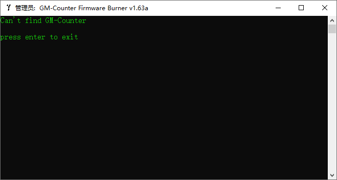
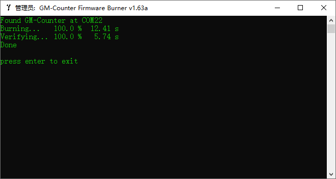
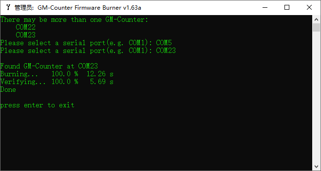

# GM-Counter Firmware Burner

This software is used for burning firmware to GM-Counter.
The MCU of GM-Counter is STM32L051C8T6.
So this software can also be used for burning firmware to any STM32L051C8T6.

## usage
- for burning default firmware, just double-click this software
- for burning specific firmware(`*.hex`), just drag firmware(`*.hex`) to this software

When there is no GM-Counter connected to PC, the software shows below:

When there is only one GM-Counter connected to PC, the software shows below:

When there are more than two GM-Counters connected to PC, the software shows below:

You should input a serial port name that you choose to burn firmware.
If you input an invalid serial port name, the software will ask you again.
